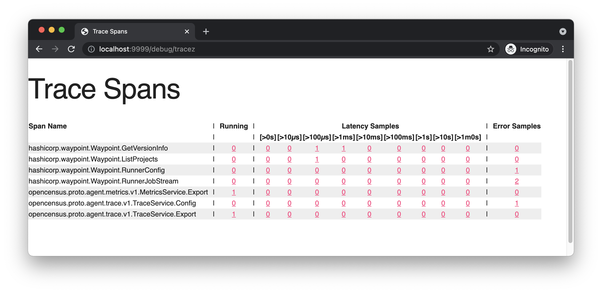

# Telemetry

Waypoint can publish internal telemetry, including server gRPC traces.
This directory contains examples and sample infrastructure for consuming that telemetry.

### Docker-Compose
This directory contains a docker compose file to bring up OpenCensus infrastructure
for consuming and forwarding metrics (an agent and a collector), a Jeager
all-in-one container for viewing trace data, and a Datadog agent for
forwarding traces to Datadog. If you wish to use the Datadog exporter, you'll
need to supply a `DD_API_KEY` environment variable to the docker compose, like so:

```
DD_API_KEY=<redacted> docker-compose up
```

If you do not provide a DD_API_KEY, the Datadog agent will fail to start, but the
rest of the infrastructure will function correctly.

### Waypoint Server -> Jeager example


The Waypoint server supports multiple exporters, but this example will show exporting
to the OpenCensus agent, and viewing traces in Jeager.

#### Run the docker-compose infrastructure
Run `docker-compose up` within this directory. You do not need to specify a `DD_API_KEY`

#### Run the waypoint server

Provide the following flags to the Waypoint server (either via extra flags passed to `waypoint server install` after a `--`,
or as flags to `waypoint server run`):

- `-telemetry-opencensus-agent-addr=127.0.0.1:55678`
- `-telemetry-opencensus-agent-insecure`
- `-telemetry-opencensus-zpages-addr=localhost:9999` (not required, but useful for troubleshooting)

A full example of a `waypoint server run` command:
```
waypoint server run \
  -advertise-addr=127.0.0.1:9701 -listen-grpc=127.0.0.1:9701 -listen-http=127.0.0.1:9702 \
  -db=/tmp/data.db -accept-tos -advertise-tls-skip-verify -url-enabled -vv \
  -telemetry-opencensus-agent-addr=127.0.0.1:55678 \
  -telemetry-opencensus-zpages-addr=localhost:9999 \
  -telemetry-opencensus-agent-insecure \
```

You may observe in the debug logs that the opencensus agent exporter and zPages server have started.

For detailed server telemetry documentation, see the flags prefixed with `-telemetry`
at https://www.waypointproject.io/commands/server-run#command-options. 

#### Make gRPC requests to the Waypoint server

[Bootstrap](https://www.waypointproject.io/commands/server-bootstrap) your server if you're running it for the first
time via `server-run`, or run any Waypoint CLI commands against your server (i.e. `waypoint context verify`).
When the Waypoint server handles any gRPC request, it will send a trace to the OpenCensus agent, which will
forward it to the OpenCensus collector, which will forward it to Jeager.

#### Observe traces in local Jaeger

Wait a moment, then visit http://localhost:16686/. Observe that a service `waypoint` exists. Choose "Find Traces"
with the Waypoint service selected, and observe traces!


### Troubleshooting

You can troubleshoot the flow of traces by visiting the zPages endpoints:
- on the Waypoint server (if enabled with the `-telemetry-opencensus-zpages-addr=localhost:9999` flag) at http://localhost:9999/debug/tracez
- on the OpenCensus agent container at http://localhost:9998/debug/tracez
- on the OpenCensus collector container at http://localhost:9997/debug/tracez

Example tracez on the Waypoint server:

